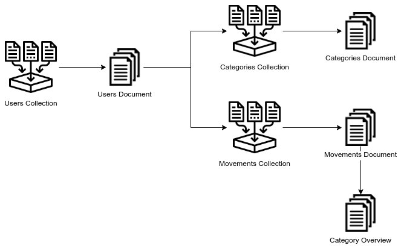
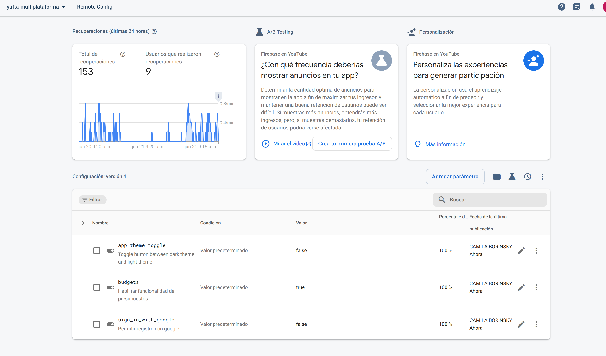
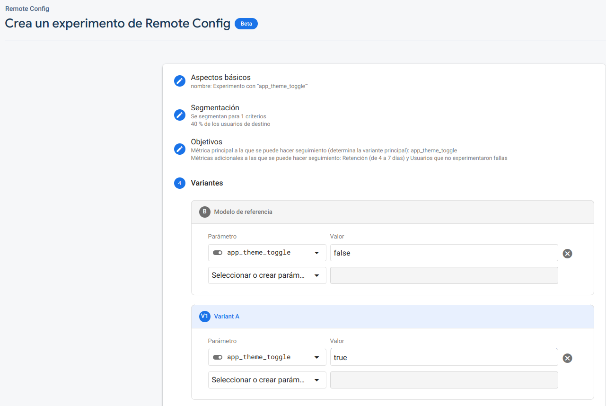
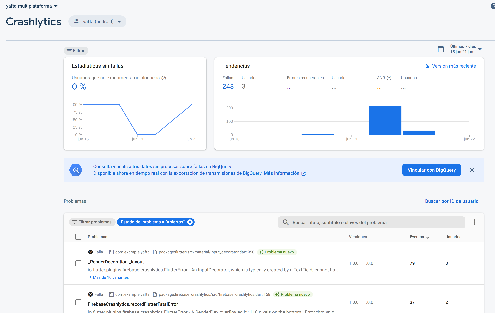
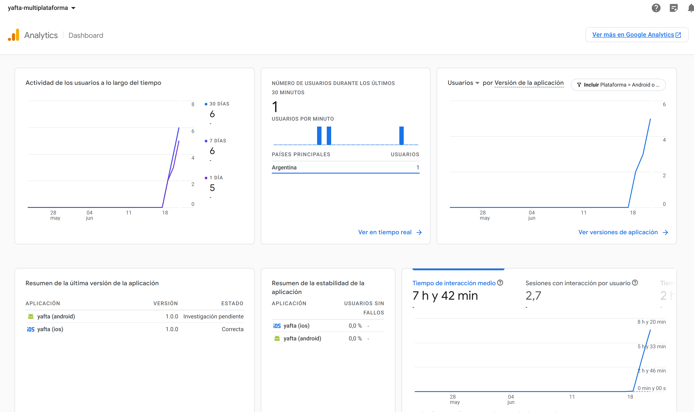
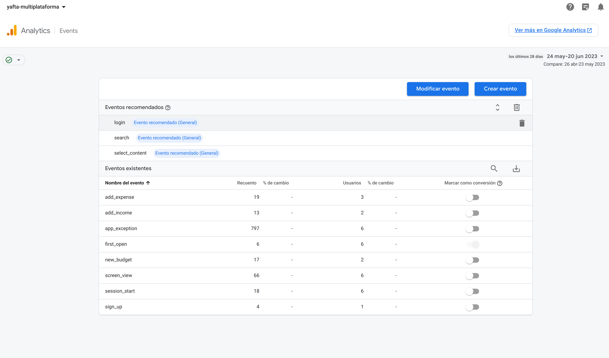

# AFTA

## Yet Another Financial Tracker App

Este proyecto tiene como objetivo ayudar a las personas a realizar un seguimiento de sus movimientos de dinero diariamente además de permitir configurar objetivos y presupuestos mensuales por categorías.

Elegimos desarrollar la aplicación utilizando el framework de [Flutter](https://flutter.dev/). Flutter es un framework de código abierto desarrollado por Google para crear aplicaciones multiplataforma con un mismo código fuente.
Utiliza el lenguaje de programación [Dart](https://dart.dev/) optimizado para el desarrollo de UI.

Si bien Flutter permite crear aplicaciones nativas para Android, iOS, Windows, Mac, Linux y web este proyecto fue desarrollado con el propósito de que sea una aplicación móvil. En el futuro podría considerarse hacer los ajustes necesarios de interfaz y UI para que pueda utilizarse en la web y/o en escritorio.

## Contribuidores

El siguiente proyecto se desarrolló para la materia Desarrollo de Aplicaciones Móviles Multiplataforma del Instituto Tecnológico de Buenos Aires (ITBA) durante el primer cuatrimestre del 2023.

### Autores

- [Francisco Quesada](https://github.com/fquesada00)
- [Agustín Jerusalinsky](https://github.com/AgustinJerusalinsky)
- [Camila Borinsky](https://github.com/camilaborinsky)

## Para correr el proyecto

### Requisitos previos

- [Flutter](https://flutter.dev/docs/get-started/install)

### Pasos

1. Clonar el repositorio
2. Correr `flutter pub get` para instalar las dependencias
3. Correr la aplicación
   - En modo debug: `flutter run`
   - En modo release: `flutter run --release`
   - Para generar el build: `flutter build`

## Documentación

---

### **Requerimientos Funcionales**

A continuación se encuentran los requerimientos funcionales del proyecto.

- Autenticación
  - El usuario debe poder registrarse en la aplicación utilizando su correo electrónico y una contraseña o utilizando su cuenta de Google
  - El usuario debe poder iniciar sesión en la aplicación utilizando su correo electrónico y contraseña o utilizando su cuenta de Google
  - El usuario debe poder cerrar sesión en la aplicación
- Movimientos
  - El usuario debe poder ver una lista de todos sus movimientos
  - El usuario debe poder filtrar los movimientos por categoría
  - El usuario debe poder filtrar los movimientos por fecha
  - El usuario debe poder crear movimientos cargando el motivo, el monto, la categoría y la fecha
  - El usuario debe poder eliminar los movimientos cargados
  - El usuario debe poder ver un resumen de sus movimientos y balance del día, del mes y total.
- Categorías
  - El usuario debe poder ver una lista de todas sus categorías
  - El usuario debe poder crear categorías cargando el nombre, el tipo (ingreso o gasto) y monto máximo
  - El usuario debe poder editar las categorías cargadas
- Perfil
  - El usuario debe poder ver su perfil

---

### **Diseño**

En base a los requerimientos funcionales se diseñó la siguiente [interfaz de usuario](https://www.figma.com/file/Kfm8cgmRDOEx6UqzhcqaWd/YAFTA-%7C-DAMM?type=design&node-id=1%3A20&t=scUkePILMglRTDtS-1).
Para la implementación del design system de YAFTA usamos la metodología de [Atomic Design](https://bradfrost.com/blog/post/atomic-web-design/). Dado que en el equipo no contamos con ningún diseñador UX/UI, decidimos utilizar componentes de [Material Design](https://material.io/design). Además la mayoría de los componentes mobile de Material Design ya están [implementados en Flutter](https://docs.flutter.dev/ui/widgets/material).

---

### **Estructura del proyecto**

Para este proyecto decidimos la siguiente estructura de archivos y directorios:

```
├── lib
│   ├── main.dart
│   ├── firebase_options.dart
|   ├── design_system
│   │   ├── tokens
│   │   ├── atoms
│   │   ├── molecules
│   │   └── cells
│   ├── routing
│   │   ├── router_provider.dart
│   │   ...
│   ├── screens
│   │   ├── auth
│   │   ├── budgets
│   │   ...
│   ├── models
│   │   ├── user.dart
│   │   ...
│   ├── data
|   |   └── firestore_service.dart
│   ├── services
│   │   ├── auth_provider.dart
│   │   ...
│   └── utils
        ├── analytics.dart
        ...


```

Optamos por esta estructura porque es intuitivo para el futuro mantenimiento del proyecto.

- `design_system`: contiene los componentes plasmados en el figma separados por átomos, moléculas y células como propone _atomic_design_.
- `routing`: contiene el router de la aplicación y utilidades del mismo. En este caso utilizamos [GoRouter](https://pub.dev/packages/go_router) para manejar las rutas de la aplicación.
- `screens`: contiene las pantallas de la aplicación. Dentro de la carpeta se encuentran los widgets organizados por feature. Es por esto que tenemos un subdirectorio `auth`, `budgets`, etc.
- `models`: contiene los modelos de datos de la aplicación.
- `data`: contiene los servicios de acceso a datos. En este caso utilizamos [Cloud Firestore](https://firebase.google.com/docs/firestore) como base de datos.
- `services`: contiene los servicios de la aplicación, es decir los que manejan el estado detrás de la interfaz. Utilizamos [Provider](https://pub.dev/packages/provider) para el manejo de estado.
- `utils`: contiene utilidades de la aplicación. Tenemos handlers para [FirebaseAnalytics](https://firebase.google.com/docs/analytics/get-started?platform=flutter) y para [RemoteConfig](https://firebase.google.com/docs/remote-config/get-started?platform=flutter). Además definimos algunos validadores de formularios y otras utilidades reutilizables.

---

### **Backend**

Para el back de la aplicación optamos por utilizar dos servicios de Firebase con capa gratuita:

[Firebase Authentication](https://firebase.google.com/docs/auth) para la autenticación de usuarios. Elegimos utilizar este servicio porque la integración con Flutter es muy sencilla porque hay un SDK que facilita la implementación. Además Firebase Authentication nos permite utilizar diferentes métodos de autenticación como correo electrónico y contraseña, Google, Facebook, Twitter, GitHub y más. Otro factor es que utilizamos otros servicios de Firebase y la integración con estos servicios es muy simple.

[Firebase Cloud Firestore](https://firebase.google.com/docs/firestore) para la base de datos. Elegimos este servicio porque la integración con Flutter es muy sencilla porque hay también un SDK. La integración de este servicio con Authentication lo resuelve Firebase teniendo que hacer muy poca configuración. La base de datos que ofrece Firestore es noSQL y maneja colecciones de documentos.



Podemos ver en el diagrama como es el esquema de colecciones que almacenamos en Authentication y Firestore.

La tabla de usuarios la maneja exclusivamente Firebase Auth, no agregamos además una colección en Firestore para no complicarnos con la sincronización de datos. Luego tenemos una colección de categorías y una de movimientos. En la colección de categorías almacenamos el nombre, el tipo (ingreso y gasto) y el monto máximo de cada categoría. En la colección de movimientos almacenamos el motivo, el monto, la categoría y la fecha de cada movimiento.

---

### **State Management**

Para el manejo de estados elegimos utilizar el paquete [Provider](https://pub.dev/packages/provider). Una de las razonas para elegir este framework es que en su simplicidad mantiene alejado los widgets de la lógica de la app. Además la comunidad detrás del paquete es muy activa y la variedad de código disponible de referencia es muy útil. Como consiste de pocos componentes, el overhead es poco, y la curva de aprendizaje es muy rápida.

Los providers que definimos en nuestra aplicación son:

- `AuthProvider`: maneja el estado de autenticación de la aplicación.
- `MovementProvider`: maneja la recuperación, creación y eliminación de movimientos.
- `BudgetProvider`: maneja la recuperación, creación y eliminación de categorías.
- `AppNavigation`: maneja la navegación general de la aplicación.

Dentro del `MovementProvider` y `BudgetProvider` manejamos distintas variables con colecciones de modelos, que además marcamos con flags de `dirty` cuando consideramos que es necesario volver a buscar a la base de datos estos valores. Esto podría ocurrir cuando se crea, se edita o se elimina un documento.

---

### **Testing**

La aplicación cuenta con tests unitarios y golden tests.
_Golden tests_
Para este tipo de test utilizamos [GoldenToolkit](https://pub.dev/packages/golden_toolkit) que nos permite comparar widgets con `golden snapshots`. Para generar los snapshots ejecutamos el siguiente comando:

```
flutter test --update-goldens
```

Dentro de la configuración del test puede especificarse los dispositivos para los cuales se generan los snapshots y también de qué pantalla queremos generarlos.

Esto nos permitió durante el desarrollo identificar _overflows_ o problemas visuales que un testing manual no hubiera detectado, porque hace pruebas rápido sobre múltiples dispositivos.

---

### **Routing**

Para el routing de la aplicación optamos por usar [GoRouter](https://pub.dev/packages/go_router). Este paquete es declarativo y minimalista y se construyó sobre el Navigator 2.0 de flutter. Lo elegimos porque la curva de aprendizaje es muy rápida y está en mantenimiento constante.

Como en nuestra aplicación tenemos un `BottomNavigationBar` como principal componente de navegación podemos dividir las rutas en 2 grupos:

- Rutas que se muestran en el `BottomNavigationBar`
  - `/`: pantalla de inicio
  - `/incomes`: pantalla de categorías
  - `/expenses`: pantalla de perfil
  - `/budgets`: pantalla de presupuestos
- Rutas que son independientes de la navegación principal de la aplicación:
  - `/login`: pantalla de login
  - `/signup`: pantalla de registro

**Deep Linking**

GoRouter también nos permitió implementar _deep_linking_ casi sin más configuración, alcanzó con agregar la configuración nativa requerida en cada sistema operativo. Creemos que esto puede explotarse en nuestra app si en un futuro una aplicación como MercadoPago se integrara y te permitiera luego de hacer un pago redirigirte directo a nuestra aplicación con los datos precargados para crear un movimiento.

Para pre cargar datos de un ingreso:

_Android_

https://yafta.com/add/incomes?amount=500000&description=sueldo

_IOS_

appscheme://yafta.com/add/incomes?amount=500000&description=sueldo

Para pre cargar datos de un gasto:

_Android_

https://yafta.com/add/expenses?amount=12000&description=supermercado

_IOS_

appscheme://yafta.com/add/expenses?amount=12000&description=supermercado

---

### **Feature Flags**

De la lista de opciones a implementar nosotros elegimos _Feature flagging_ porque sabemos que es un obstáculo en el desarrollo mobile el tiempo que demora poder llevar un release a los dispositivos de los usuarios. Poder tener una herramienta de configuración remota permite activar y desactivar funcionalidades sin tener que pasar todo el proceso de deploy.

Para esto utilizamos [Firebase Remote Config](https://firebase.google.com/docs/remote-config) que nos permite definir variables de configuración y luego poder cambiarlas desde la consola de Firebase. A su vez tiene un SDK para flutter logrando desde el código de la aplicación acceder a estas variables y mostrar o no ciertas funcionalidades.



Podemos ver en la imagen los valores de configuración que elegimos para la aplicación.

- `sign_in_with_google`: permite activar o desactivar el botón de login con Google. Decidimos por defecto dejarlo en `false` porque hay que verificar nuestra aplicación con Google para poder usar este servicio de forma segura. Además en AppStore si se agrega otro proveedor para la autenticación debe agregarse también el `Sign in with Apple`. Por lo tanto, esta es una feature que tenemos que tener apagada hasta antes no resolver estos temas.

- `budgets`: decidimos prender la feature de budgets porque es importante para la aplicación, pero nos pareció interesante usarla como ejemplo para mostrar como se puede activar o desactivar una funcionalidad grande de forma remota. Tener la estructura de proyecto agrupada por feature hizo que esta lógica sea más fácil de implementar.

- `app_theme_toggle`: esta es la feature flag que decidimos usar para el experimento de A/B testing. La idea es permitir a un 40% de los usuarios de android cambiar su aplicación a `dark_theme` con un toggle. Este experimento se puede configurar desde Firebase Remote Config. Hace falta definir un evento a observar para poder medir el impacto de este experimento.



En la imagen se ve la creación del experimento de A/B testing en base a el flag `app_theme_toggle`. Se puede ver que se puede definir el porcentaje de usuarios que van a ver la feature y también el evento que se va a observar para medir el impacto de la misma.

---

### **Monitoreo**

_Crashlytics_

Implementamos en la aplicación un servicio de Analytics y Crashlytics de Firebase. Esto nos permite monitorear el uso de la aplicación y también los errores que se producen en la misma.

Elegimos utilizar los que proveía Firebase dado que el resto de los servicios que usamos también son de Firebase y la integración es muy sencilla por el SDK que proveen para Flutter.



Podemos ver en la imagen como se ve el tablero de Crashlytics de Firebase se configuran las aplicaciones. Muestra estadísticas por usuario y por tipo de falla, y en la parte de abajo una tabla con todos los errores reportados.

La configuración es super sencilla y de mucho valor porque como la aplicación corre en los dispositivos de los usuarios, es muy difícil sin una herramienta así poder recopilar información sobre los errores que se producen en la aplicación.

_Analytics_

Además de poder reportar errores es importante para el negocio poder detectar cuales son las interacciones de los usuarios para poder priorizar las funcionalidades que más se utilizan y mejorar las que menos se utilizan.



Para esto definimos algunos eventos personalizados que nos permiten ver en el tablero de Analytics de Firebase las interacciones de los usuarios con la aplicación.



En la segunda imagen podemos ver los diferentes eventos que definimos para la aplicación.

Inicialmente nos gustaría saber en qué medida se están utilizando las features de la aplicación. Si se notara poco o uso casi nulo en el agregado de ingresos o gastos, podríamos pensar en eliminar esas funcionalidades y simplificar la aplicación. Por el contrario si se notara mucho uso en esas funcionalidades podríamos pensar en priorizar hacer que la experiencia de usuario sea mejor en esos casos. Para esto definimos los eventos que se disparan cada vez que un usuario crea un gasto o un ingreso:

- `add_expense`
- `add_income`

Por otro lado uno de nuestros feature flags que definimos y tenemos activados es el poder crear y agrupar gastos e ingresos por categorías asignando un presupuesto mensual a la misma. Cuando un usuario crea un presupuesto disparamos el siguiente evento para poder medir si esta feature está teniendo una buena respuesta:

- `new_budget`

Otra de nuestras feature flags (con la que realizamos el A/B testing) es permitir a algunos usuarios poner la aplicación en dark theme. Para evaluar los resultados de este experimento definimos el parámetro:

- `toggle_app_theme`

que se dispara cada vez que un usuario cambia el tema de la aplicación.

Por último definimos un evento para medir la cantidad de usuarios que se registran en la aplicación, porque si bien es genérica no deja de ser una métrica importante ya que queremos que sea de uso masivo:

- `signup`

---

### **Seguridad**

---
